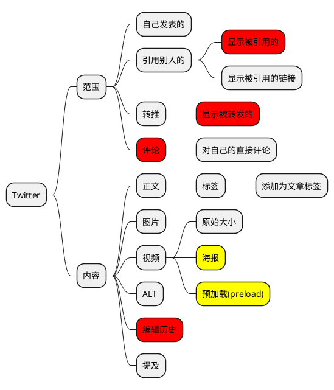

# 推特（Twitter/X）导入器

## 支持

黄色表示保留但未设置，红色表示不（完全）支持。

```plantuml
@startmindmap
+ Twitter
++ 范围
+++ 自己发表的
+++ 引用别人的
++++[#red] 显示被引用的
++++ 显示被引用的链接
+++ 转推
++++[#red] 显示被转发的
+++[#red] 评论
++++ 对自己的直接评论
++ 内容
+++ 正文
++++ 标签
+++++ 添加为文章标签
+++ 图片
+++ 视频
++++ 原始大小
++++[#yellow] 海报
++++[#yellow] 预加载(preload)
+++ ALT
+++[#red] 编辑历史
+++ 提及
@endmindmap
```
