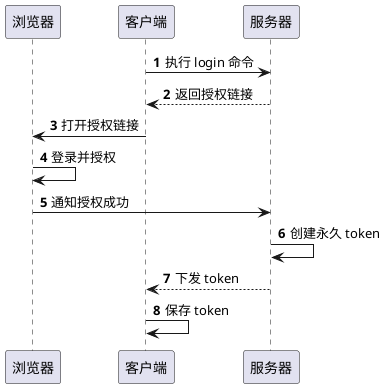

# 客户端登录

```plantuml
@startuml
autonumber

participant 浏览器 as b
participant 客户端 as c
participant 服务器 as s

c -> s: 执行 login 命令
s --> c: 返回授权链接
c -> b: 打开授权链接
b -> b: 登录并授权
b -> s: 通知授权成功
s -> s: 创建永久 token
s --> c: 下发 token
c -> c: 保存 token

@enduml
```
