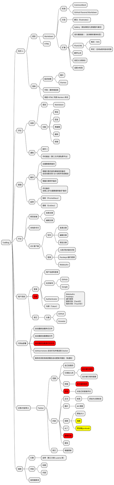

# 博客支持功能列表

```plantuml
@startmindmap

* TaoBlog
** 写作 ✏️
*** 语言
**** Markdown
***** 标准
     * CommonMark
     * GitHub Flavored Markdown
***** 方言
     * 脚注（Footnotes）
***** 扩展
     * Gallery（类似微信九宫格图片展览）
     * 音乐播放器 🎵 （支持解析媒体标签）
     * PlantUML
      * 格式：SVG
      * 样式：日间&夜间自动切换
     * 数学公式
     * 自定义分割线🧵
     * 话题 #标签
**** HTML
*** 渲染
**** 延迟加载
***** 图片
***** iframes
**** 代码：服务端渲染
**** 保留 HTML 列表 Markers 样式

** 评论
*** 发表
**** 语言
    * Markdown
   * 功能
    * 预览
    * 回复
    * 再编辑
    * 删除
    * 转移
*** 通知
**** 邮件 📧
**** 手机推送（第三方开源免费平台）

** 管理
*** 备份
**** 全量数据库备份
****:增量文章内容及基础信息备份
会自动提交到 Git 仓库并完成推送;
**** 增量文章附件备份
****:评论备份
会随上述“全量数据库备份”备份;
*** 监控
**** 指标（Prometheus）
**** 面板（Grafana）

** 平台
  * 网页前端
   * 发表文章
   * 编辑文章
  * 本地命令行
  * iOS 客户端
   * 写作
    * 发表文章
    * 编辑文章
    * 预览文章
   * 登录
    * 人脸识别/指纹识别
    * Passkeys/通行密钥
    * WebAuthn

** 用户系统
*** 登录
**** 用户名密码登录
**** 社交帐号
***** GitHub
***** Google
**** Authenticator
*****:WebAuthn
Passkeys
通行密钥
面部识别（FaceID）
指纹识别（TouchID）;
**** 令牌（Token）
***[#red] 注册
*** 其它
**** 头像
***** GitHub
***** Gravatar

** 代码&部署
*** 自动重新加载样式文件
*** 自动重新加载模板文件
***[#red] 自动重新加载源代码文件
*** GitHub Actions 自动打包并推送到 Docker
*** 服务检测到有新部署后自动更新并重启（有通知）

** 迁移/内容导入
+++ Twitter
++++ 范围
+++++ 自己发表的
+++++ 引用别人的
++++++[#red] 显示被引用的
++++++ 显示被引用的链接
+++++ 转推
++++++[#red] 显示被转发的
+++++[#red] 评论
++++++ 对自己的直接评论
++++ 内容
+++++ 正文
++++++ 标签
+++++++ 添加为文章标签
+++++ 图片
     * 4K 原图
+++++ 视频
++++++ 原始大小
++++++[#yellow] 海报
++++++[#yellow] 预加载(preload)
+++++ ALT
+++++[#red] 编辑历史
+++++ 提及
++++ 其它
    * 增量更新

 * 搜索
  * 引擎
   * 自带（第三方类 Lucene 库）
  * 字段
   * 标题
   * 内容
  * 高亮搜索词

@endmindmap
```
