# 测试页面

## 二号标题

### 三号标题

#### 四号标题

##### 五号标题

###### 六号标题

---

## 文本

### 段落

这是段落。

这是第二段。

### 引用

普通文本引用内容。

> A block quotation (also known as a long quotation or extract) is a quotation in a written document, that is set off from the main text as a paragraph, or block of text.
>
> It is typically distinguished visually using indentation and a different typeface or smaller size quotation. It may or may not include a citation, usually placed at the bottom.

GitHub 的 Alerts。

> [!NOTE]
> Useful information that users should know, even when skimming content.

> [!TIP]
> Helpful advice for doing things better or more easily.

> [!IMPORTANT]
> Key information users need to know to achieve their goal.

> [!WARNING]
> Urgent info that needs immediate user attention to avoid problems.

> [!CAUTION]
> Advises about risks or negative outcomes of certain actions.

### 列表

有序列表：

1. 第一条
2. 第二条
   1. 第二、一条
   2. 第二、二条
3. 第三条

无序列表：

* 第一条
* 第二条
  * 第二、一条
  * 第二、二条
* 第三条

各种 Markers：

- 111
- 222

+ 111
+ 222

* 111
* 222

1. 111
2. 222

1) 111
2) 222

### 详细/展开

* 鼠标放在“总结”上面应该有箭头指示展开方向。

<details>
<summary>总结</summary>

详细内容。

更详细的内容。

</details>

### 水平分隔线

---

--- 自定义 ---

### 表格

* 表头应该是 sticky 的。

| Tables   |      Are      |  Cool |
|----------|:-------------:|------:|
| col 1 is |  left-aligned | $1600 |
| col 2 is |    centered   |   $12 |
| col 3 is | right-aligned |    $1 |

### 代码

* 键盘：<kbd>Ctrl</kbd> + <kbd>C</kbd>
* 行内代码：`<div>code</div>`
* 块级代码：

  ```go
  // You can edit this code!
  // Click here and start typing.
  package main
  
  import "fmt"
  
  func main() {
  	fmt.Println("Hello, 世界")
  }
  ```

### 行内元素

[这是一个链接](https://example.com)。
**这是粗体文本**，*这是斜体文本*，~~这是删除线文本~~。

## 嵌入元素

### 图片

不存在的图片：


不存在、带 alt 的图片：


## 表单

### 输入框

* 文本：<input type=text />
* 密码：<input type=password />
* 网址：<input type=url />
* 邮箱：<input type=email />
* 日期：<input type=datetime-local />
* 编辑：<textarea></textarea>

### 按钮

* 提交：<input type=submit value="提交按钮" /><input type=submit value="禁用" disabled="" />
* 重置：<input type=reset value="重置按钮" />
* 按钮：<input type=button value="输入按钮" />
* 按钮：<button>普通按钮</button><button disabled="">禁用</button>

### 选择

下拉框：<select>
	<option>选项一</option>
	<option>选项二</option>
	<option>选项三</option>
</select>

复选框：<label><input type=checkbox />选项一</label>
<label><input type=checkbox />选项二</label>
<label><input type=checkbox />选项三</label>

单选框：<label><input type=radio name="r" />选项一</label>
<label><input type=radio name="r" />选项一</label>
<label><input type=radio name="r" />选项一</label>

## 其它

### 对话框

<button onclick="document.querySelector('#dialog').showModal()">显示</button>

<dialog id="dialog">
  <p>一段文字。</p>
  <form method="dialog">
    <input type="submit" value="关闭" />
  </form>
</dialog>

### 话题

这里包含一个#话题。

## 渲染

### 表情符号

[doge][捂脸][狗头][皱眉]

### 公式

行内公式：$x = {-b \pm \sqrt{b^2-4ac} \over 2a}.$

块级公式：

$$
x = {-b \pm \sqrt{b^2-4ac} \over 2a}.
$$

### PlantUML


### Pikchr

来源：<https://pikchr.org/home/pikchrshow>，“Core Object Types”

```pikchr
AllObjects: [
# First row of objects
box "box"
box rad 10px "box (with" "rounded" "corners)" at 1in right of previous
circle "circle" at 1in right of previous
ellipse "ellipse" at 1in right of previous
# second row of objects
OVAL1: oval "oval" at 1in below first box
oval "(tall &" "thin)" "oval" width OVAL1.height height OVAL1.width at 1in right of previous
cylinder "cylinder" at 1in right of previous
file "file" at 1in right of previous
# third row shows line-type objects
dot "dot" above at 1in below first oval
line right from 1.8cm right of previous "lines" above
arrow right from 1.8cm right of previous "arrows" above
spline from 1.8cm right of previous go right .15 then .3 heading 30 then .5 heading 160 then .4 heading 20 then right .15
"splines" at 3rd vertex of previous
# The third vertex of the spline is not actually on the drawn
# curve.  The third vertex is a control point.  To see its actual
# position, uncomment the following line:
#dot color red at 3rd vertex of previous spline
# Draw various lines below the first line
line dashed right from 0.3cm below start of previous line
line dotted right from 0.3cm below start of previous
line thin   right from 0.3cm below start of previous
line thick  right from 0.3cm below start of previous
# Draw arrows with different arrowhead configurations below
# the first arrow
arrow <-  right from 0.4cm below start of previous arrow
arrow <-> right from 0.4cm below start of previous
# Draw splines with different arrowhead configurations below
# the first spline
spline same from .4cm below start of first spline ->
spline same from .4cm below start of previous <-
spline same from .4cm below start of previous <->
] # end of AllObjects
# Label the whole diagram
text "Examples Of Pikchr Objects" big bold  at .8cm above north of AllObjects
```

### GraphViz

```dot
digraph FamilyTree {
    rankdir=TB;
    node [shape=box, style=filled];

    "爷爷" [fillcolor=lightblue];
    "奶奶" [fillcolor=pink];
    "爸爸" [fillcolor=lightblue];
    "妈妈" [fillcolor=pink];
    "叔叔" [fillcolor=lightblue];
    "婶婶" [fillcolor=pink];
    "我" [fillcolor=lightblue];
    "堂兄" [fillcolor=lightblue];
    "堂妹" [fillcolor=pink];
    "孩子1" [fillcolor=lightblue];
    "孩子2" [fillcolor=pink];

    "爷爷" -> "爸爸";
    "爷爷" -> "叔叔";
    "奶奶" -> "爸爸";
    "奶奶" -> "叔叔";

    "爸爸" -> "我";
    "妈妈" -> "我";
    
    "叔叔" -> "堂兄";
    "叔叔" -> "堂妹";

    "我" -> "孩子1";
    "我" -> "孩子2";
    
    "爷爷" -> "奶奶" [style=dashed];
    "爸爸" -> "妈妈" [style=dashed];
    "叔叔" -> "婶婶" [style=dashed];
}
```



### 族谱图

```genealogy
- id: 1
  name: 😄
- id: 2
  name: 💧
  spouse: 1
- id: 3
  name: 😅
  father: 1
  mother: 2
```
