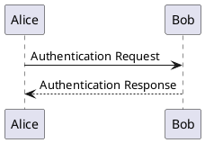
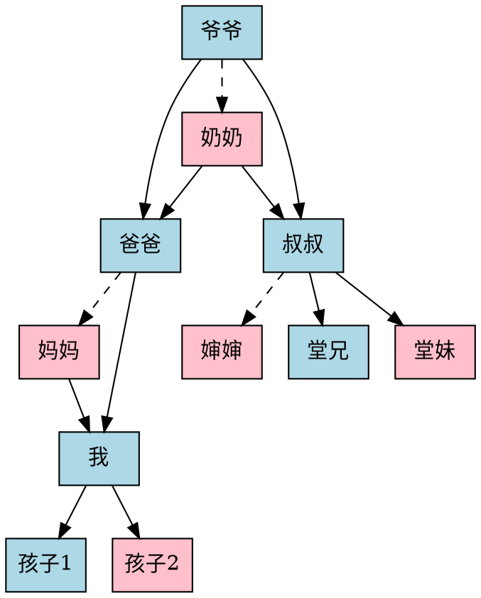

# 测试页面

本页源码：[index.md](index.md)。

这是段落。

## 二号标题

这是段落。

## 二号标题2

### 三号标题

这是段落。

#### 四号标题

这是段落。

##### 五号标题

这是段落。

###### 六号标题

这是段落。

---

## 文本

### 样式

**加粗** *斜体* ***加粗斜体*** ~~删除线~~

<ins>插入的文本</ins> 和 <del>删除的文本</del>

## 颜色

<colors></colors>

### 段落

这是段落。

这是第二段。

### 引用

普通文本引用内容。

> A block quotation (also known as a long quotation or extract) is a quotation in a written document, that is set off from the main text as a paragraph, or block of text.
>
> It is typically distinguished visually using indentation and a different typeface or smaller size quotation. It may or may not include a citation, usually placed at the bottom.

GitHub 的 Alerts。

> [!NOTE]
> Useful information that users should know, even when skimming content.

> [!TIP]
> Helpful advice for doing things better or more easily.

> [!IMPORTANT]
> Key information users need to know to achieve their goal.

> [!WARNING]
> Urgent info that needs immediate user attention to avoid problems.

> [!CAUTION]
> Advises about risks or negative outcomes of certain actions.

### 列表

有序列表：

1. 第一条
2. 第二条
   1. 第二、一条
   2. 第二、二条
3. 第三条

无序列表：

* 第一条
* 第二条
  * 第二、一条
  * 第二、二条
* 第三条

各种 Markers：

- 111
- 222

+ 111
+ 222

* 111
* 222

1. 111
2. 222

1) 111
2) 222

### 详细/展开

* 鼠标放在“总结”上面应该有箭头指示展开方向。

<details>
<summary>总结</summary>

详细内容。

更详细的内容。

</details>

### 水平分隔线

---

--- 自定义 ---

### 表格

* 表头应该是 sticky 的。

| Tables   |      Are      |  Cool |
|----------|:-------------:|------:|
| col 1 is |  left-aligned | $1600 |
| col 2 is |    centered   |   $12 |
| col 3 is | right-aligned |    $1 |

CSV 表格：

```csv
Year,Make,Model,Description,Price
1997,Ford,E350,"ac, abs, moon",3000.00
1999,Chevy,"Venture ""Extended Edition""","",4900.00
1999,Chevy,"Venture ""Extended Edition, Very Large""","",5000.00
1996,Jeep,Grand Cherokee,"MUST SELL!,,""
air, moon roof, loaded",4799.0
```

### 代码

* 键盘：<kbd>Ctrl</kbd> + <kbd>C</kbd>
* 行内代码：`<div>code</div>`
* 块级代码：

  ```go
  // You can edit this code!
  // Click here and start typing.
  package main
  
  import "fmt"
  
  func main() {
  	fmt.Println("Hello, 世界")
  }
  ```

### 行内元素

[这是一个链接](https://example.com)。
**这是粗体文本**，*这是斜体文本*，~~这是删除线文本~~。

## 嵌入元素

### 图片

不存在的图片：


不存在、带 alt 的图片：


## 表单

### 输入框

* 文本：<input type=text value="Text"><input type=text value="Text" disabled>
* 密码：<input type=password value="Password"><input type=password value="Password" disabled>
* 网址：<input type=url><input type=url disabled>
* 邮箱：<input type=email><input type=email disabled>
* 日期：<input type=datetime-local>
* 编辑：<textarea></textarea>

### 按钮

* 提交：<input type=submit value="提交按钮"><input type=submit value="禁用" disabled="">
* 重置：<input type=reset value="重置按钮">
* 按钮：<input type=button value="输入按钮">
* 按钮：<button>普通按钮</button><button disabled="">禁用</button>

### 选择

下拉框：<select>
	<option>选项一</option>
	<option>选项二</option>
	<option>选项三</option>
</select>

复选框：<label><input type=checkbox>选项一</label>
<label><input type=checkbox>选项二</label>
<label><input type=checkbox>选项三</label>

单选框：<label><input type=radio name="r">选项一</label>
<label><input type=radio name="r">选项二</label>
<label><input type=radio name="r">选项三</label>

## 其它

### 对话框

<button onclick="document.querySelector('#dialog').showModal()">显示</button>

<dialog id="dialog">
  <p>一段文字。</p>
  <form method="dialog">
    <input type="submit" value="关闭">
  </form>
</dialog>

### 话题

这里包含一个#话题。

## 渲染

### 表情符号

[doge][捂脸][狗头][皱眉]

### 公式

行内公式：$x = {-b \pm \sqrt{b^2-4ac} \over 2a}.$

块级公式：

$$
x = {-b \pm \sqrt{b^2-4ac} \over 2a}.
$$

化学式：

$$
\ce{CO2 + C -> 2 CO}
$$

### 实况照片


### PlantUML



### Pikchr

来源：<https://pikchr.org/home/pikchrshow>，“Core Object Types”

```pikchr
AllObjects: [
# First row of objects
box "box"
box rad 10px "box (with" "rounded" "corners)" at 1in right of previous
circle "circle" at 1in right of previous
ellipse "ellipse" at 1in right of previous
# second row of objects
OVAL1: oval "oval" at 1in below first box
oval "(tall &" "thin)" "oval" width OVAL1.height height OVAL1.width at 1in right of previous
cylinder "cylinder" at 1in right of previous
file "file" at 1in right of previous
# third row shows line-type objects
dot "dot" above at 1in below first oval
line right from 1.8cm right of previous "lines" above
arrow right from 1.8cm right of previous "arrows" above
spline from 1.8cm right of previous go right .15 then .3 heading 30 then .5 heading 160 then .4 heading 20 then right .15
"splines" at 3rd vertex of previous
# The third vertex of the spline is not actually on the drawn
# curve.  The third vertex is a control point.  To see its actual
# position, uncomment the following line:
#dot color red at 3rd vertex of previous spline
# Draw various lines below the first line
line dashed right from 0.3cm below start of previous line
line dotted right from 0.3cm below start of previous
line thin   right from 0.3cm below start of previous
line thick  right from 0.3cm below start of previous
# Draw arrows with different arrowhead configurations below
# the first arrow
arrow <-  right from 0.4cm below start of previous arrow
arrow <-> right from 0.4cm below start of previous
# Draw splines with different arrowhead configurations below
# the first spline
spline same from .4cm below start of first spline ->
spline same from .4cm below start of previous <-
spline same from .4cm below start of previous <->
] # end of AllObjects
# Label the whole diagram
text "Examples Of Pikchr Objects" big bold  at .8cm above north of AllObjects
```

<!-- https://sqlite.org/docsrc/file?name=art/syntax/create-table-stmt.pikchr&ci=tip&txt=1 -->

```pikchr
     linerad = 10px
     linewid *= 0.5
     $h = 0.21

     circle radius 10%
A0:  arrow 2*arrowht
CR:  oval "CREATE" fit
T1:  oval "TEMP" fit with .w at (linewid right of CR.e,.8*$h below CR)
T2:  oval "TEMPORARY" fit with .w at 1.25*$h below T1.w
TBL: oval "TABLE" fit with .w at (linewid right of T2.e,CR)
     arrow from CR.e right even with T2; arrow to TBL.w
     arrow from CR.e right linerad then down even with T1 then to T1.w
     arrow from CR.e right linerad then down even with T2 then to T2.w
     line from T2.e right linerad then up even with TBL \
        then to arrowht left of TBL.w
     line from T1.e right even with linerad right of T2.e then up linerad
     arrow from TBL.e right
     oval "IF" fit
     arrow right 2*arrowht
     oval "NOT" fit
     arrow 2*arrowht
ETS: oval "EXISTS" fit

     # IF NOT EXISTS bypass
Y1:  .5*$h below T2.s  # vertical position of back-arrow
     arrow from TBL.e right linerad then down even with Y1 then left even with T2
     arrow from ETS.e right linerad then down even with Y1 \
        then left even with ETS.w
     line left even with TBL.w

     # second row
     arrow left even with first circle then down $h*1.25 then right 2*arrowht
SN:  oval "schema-name" fit
     arrow 2*arrowht
DOT: oval "." bold fit
     arrow
TN:  oval "table-name" fit

     # schema-name bypass
     arrow from (first circle,SN.n) down even with $h below SN \
       then right even with SN
     line right even with arrowht right of DOT.e then up even with DOT \
        then right linerad

     # Loop back from table-name 
     arrow from TN.e right linerad then down even with DOT.s-(0,2*$h) \
       then left even with DOT

     # third row
     arrow left even with first circle then down $h*1.25 then right 2*arrowht
LP:  oval "(" bold fit
     arrow
CD:  box "column-def" fit
TC:  box "table-constraint" fit with .w at CD.e+(1.5*linewid,-1.25*$h)
     arrow <- from TC.e right 1.5*arrowht
C2:  oval "," bold fit
RP:  oval ")" bold fit at (2*linewid right of C2,LP)
     arrow from RP.e right 3*arrowht
TO:  box "table-options" fit

     # column-def loop
C1:  oval "," bold fit at 1.25*$h below CD
     arrow from CD.e right linerad then down even with C1 then to C1.e
     line from C1.w left even with 2*arrowht left of CD.w then up even with CD \
       then to arrowht left of CD.w

     # table-constraint bypass
     arrow from CD.e right
     arrow to RP.w

     # table-constraint loop
     arrow from (C2.e,RP) right 2*arrowht then down even with C2 then to C2.e
     line from TC.w left linerad then up even with RP then right 2*arrowht

     # exit circle and table-options bypass
     arrow from RP.e right linerad then up 1.5*$h then right even with TO.n
     arrow right even with TO.e then right 3*arrowht
EC:  circle same

     # table-options exit
     arrow from TO.e right linerad then up 1.5*$h then right even with EC.w

     # AS select clause
     arrow from TN.e right 250%
     oval "AS" fit
     arrow 2*arrowht
     box "select-stmt" fit
     arrow right
     line right even with linerad right of TO.e then down even with last circle \
        then right linerad
```

### GraphViz



### 族谱图

```genealogy
- id: 1
  name: 😄
- id: 2
  name: 💧
  spouse: 1
- id: 3
  name: 😅
  father: 1
  mother: 2
```

### ECharts

```echarts
option = {
  legend: {},
  tooltip: {},
  dataset: {
    source: [
      ['product', '2012', '2013', '2014', '2015'],
      ['Matcha Latte', 41.1, 30.4, 65.1, 53.3],
      ['Milk Tea', 86.5, 92.1, 85.7, 83.1],
      ['Cheese Cocoa', 24.1, 67.2, 79.5, 86.4]
    ]
  },
  xAxis: [
    { type: 'category', gridIndex: 0 },
    { type: 'category', gridIndex: 1 }
  ],
  yAxis: [{ gridIndex: 0 }, { gridIndex: 1 }],
  grid: [{ bottom: '55%' }, { top: '55%' }],
  series: [
    // These series are in the first grid.
    { type: 'bar', seriesLayoutBy: 'row' },
    { type: 'bar', seriesLayoutBy: 'row' },
    { type: 'bar', seriesLayoutBy: 'row' },
    // These series are in the second grid.
    { type: 'bar', xAxisIndex: 1, yAxisIndex: 1 },
    { type: 'bar', xAxisIndex: 1, yAxisIndex: 1 },
    { type: 'bar', xAxisIndex: 1, yAxisIndex: 1 },
    { type: 'bar', xAxisIndex: 1, yAxisIndex: 1 }
  ]
};
```
